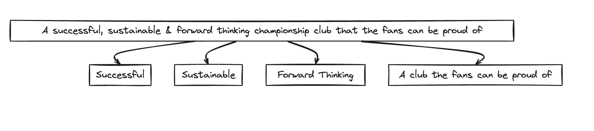

## An Introduction

The following article is an attempt to answer [my own question](https://bantamtalk.com/index.php?threads/swindon-town-vs-bradford-city-saturday-27th-january-2024-3-00pm.7826/page-13#post-840466) posted on the BantamTalk forum during the game against Swindon and hopefully offer a way forward for the club.

> "I genuinely don't know where we go from here.  
>   
> We can't keep changing manager.  
>   
> There are obviously deep problems we need to address within the club.  
> That can only start at the top."

Similarly [Derek Adams said](https://www.thetelegraphandargus.co.uk/sport/sportlatest/23898887.derek-adams-discusses-bradford-citys-lack-structure/), 

> “Bradford City has the biggest supporters base in the league. It’s one of the smallest clubs inside in the league.  
>   
> “It’s got no structure, no idea of its way out, doesn’t own its stadium, doesn’t own its training ground and has no foundation to it.

Simon Grayson also alluded to similar.

For me and many other fans, it's clear that the problems at the club run depeer than the manager. We are a club floundering, languishing in League 2 with a very real threat of going out of existence should we be relegated again. 
We own nothing other than our Football League membership. 
Although conjecture, I don't think to many people would object to the statement that we do not set up our footballing side for success.

Managers & players failures at Bradford go on to achieve success elsewhere. 
Niall Canavan being a good recent example with Barrow riding high.

Managers & players successes elsewhere go on to fail at Bradford.
Vadaine Oliver, Yann Songo & Richie Smallwood being some recent obvious examples.

So how do we arrest our alarming slide into footballing irrelevance?

One way might be to introduce a strategic vision for the club similar to the one Stockport Country (as of 28.01.24 riding high at the top of League 2) [have](https://trainingground.guru/articles/simon-wilson-stockport-countys-seven-year-plan)  (Thanks [@BantamJ](https://bantamtalk.com/index.php?threads/how-a-forward-thinking-club-could-be-successful.7604/)).
Something that Bradford City currently appear to lack. 

The following is an example of how a vision(+) could look for Bradford City.

'+' - written over a weekend, while combining it with parenting so go easy if you don't think it's perfect or needs more work.

## A Vision

A vision is something for employees & fans to rally around. 
It's opportunity and something that excites to take action in order to achieve a compelling future together and it starts with a vision statement.

Now there are most likely variations on this statement and refining it further is almost certainly necessary but I'll take a stab in the dark that both the club and it's fans would be ecstatic if Bradford City were,

> "A successful, sustainable & forward-thinking championship club that it's fans can be proud of". 

So what next?

Well once the club has aligned on what it wants to aim towards, the next step is breaking this down into smaller goals. 

In this example, it would be "successful", "sustainable", "forward-thinking", "A club that the fans can be proud of". 
For the purpose of this article I will ignore "a championship club" as the goals are fairly self explanatory and focus on the others.

### Defining Success

Let's start with successful. Again the exact definition of success will vary from team to team and although there are lots more, I'll focus for now on team performance & player performance.

Now what are we aiming for? We're aiming to break each of these goals or objectives into smaller, measurable results that can "owned" by a member of the clubs staff.

#### An example: 

An objective owned by Graham Alexander:  "Improve team performance by 10% between now and the end of the 23/24 season."

The key results supporting this could be for example.
- "Improve the number of points won from losing positions by 15%"
- "Improve the expected goals generated of set pieces by 20%."
- Or maybe even "improve our average pass completion rate (39% against Salford)"

Each of these key results could be owned by a coach, e.g. Chris Luketti or Mark Truman but the aim should be to make these measurable. 

Now footballing objectives, given the variability of professional sport might not be the best candidate for this way of thinking but I hope you get the idea.

Objectives & key results should cascade through the club, being broken into smaller and smaller pieces being owned by a single person. Most importantly, they should be measurable! 

![[Pasted image 20240128212553.png]]

If similar goals were set for player performance, e.g. Distance Run, Individual Battles, Pass Completion Rate, players performance could also be measured, and heaven forbid, we might even be able to sign players that fit those KPIs. The KPIs would become our structure and our continuity even long after Graham Alexander has gone.  

It would allow the club to communicate the things we look for in players, and measure if they improved during the time at the club. It would be the Nirvana. A joined up, forward thinking strategy for the way we play and also something for fans to buy into even if results we're going well.

Which brings me to our next point:
## A Club the Fans can be Proud of:

Fans and particularly Bradford City ones want to see their team do well but (almost) equally want to see something on the pitch they can relate to.

One of the obvious objectives here is to develop a club identity, a way of playing beyond the manager itself. 
Here key results could include being hardworking (measured by distance run), being attacking and/or creating lots of attacking chances (measured by XG) and offering young players a pathway to the first team (and not leaving them to cameos when the game is already lost).

Creating memorable moments for fans should also be an objective. Villa Park is still etched in my memory, as is the gulp I took when I saw the Arsenal team when walking to Valley Parade.

I think another big objective in build a club the fans can be proud of is transparency.

Fans aren't stupid and the "mediocrity is not acceptable" mantra we've heard for the past couple of seasons is starting to wear thin. I think fans would be much more likely to buy in to a vision over 2 or 3 years or even put their money where their mouth is if the club was transparent instead of being fed sound bites.

And lastly, fan engagement. How could we engage our fans, make them feel part of something bigger or feel more connected to the club. I don't have all the answers here but I do know it involves closely engaging with the fan base to identify what they would like to see and expect. 

Similar structures can be set up for the commercial areas of the club, where the club seems to be doing well and to become a forward thinking club, both of which I won't explain in detail given that I would like to publish this article (or at least version 1 quickly) but you can find them in the picture I put together.

## How it ties together
If a strategic vision was implemented club wide, I'd expect to see cascading goals throughout the whole organisation. It should hopefully lead to accountability beyond the manager and lead to a culture of success. 

We might even find there are some quick wins.

TBC PICTURE OF THE FULL VISION
## Won't it be expensive?
No it doesn't need to be. Ultimately leading change is about leading people which the club seems to have enough of and accountability. This starts from the top.

Of course I haven't covered how such a structure might be implemented or covered some of the "how" the club might actively measure the things needed to implement this but it doesn't have to be a huge undertaking. Maybe the club could even engage some fans who might be willing to help (providing of course the vision was clear enough). 

## What next?

I hope 

#### Call to Action

If anyone associated with the club is interested in discussing this strategic vision further, I'd be more than willing to discuss it with you.

Although I don't have experience in football, I do have experience working with enterprise companies to work on defining and implementing visions like this, predominantly in digital transformation. 

If you don't, I hope this might at least provide some inspiration or ideas about how to galvanise the club from it's current predicament. 
## Too Long Didn't Read (TLDR): 

This article discusses the need for Bradford City Football Club to develop a clear strategic vision and structure to arrest its decline. It proposes that the club set overarching goals to be a successful, sustainable, and forward-thinking club that fans can be proud of. Each goal would then be broken down into measurable objectives and key results, cascading throughout the organisation. This would provide accountability beyond individual managers and establish a culture of success. Developing fan engagement and transparency are also highlighted as important parts of building a club supporters can identify with. Overall, the passage makes an interesting case that implementing a strategic vision could help Bradford City address its deep-rooted problems in a coherent, sustainable manner without needing significant expens